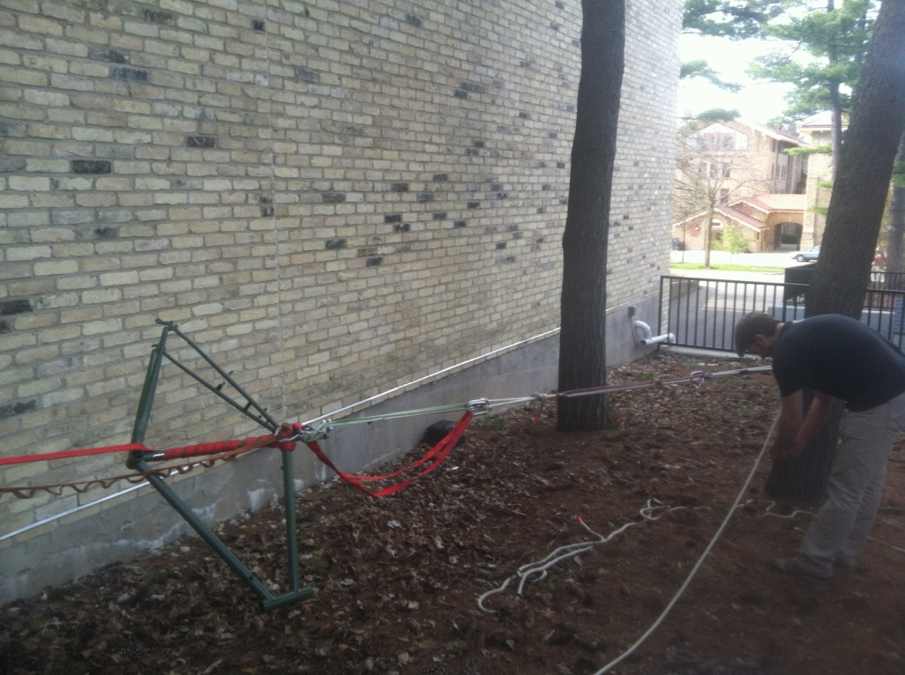
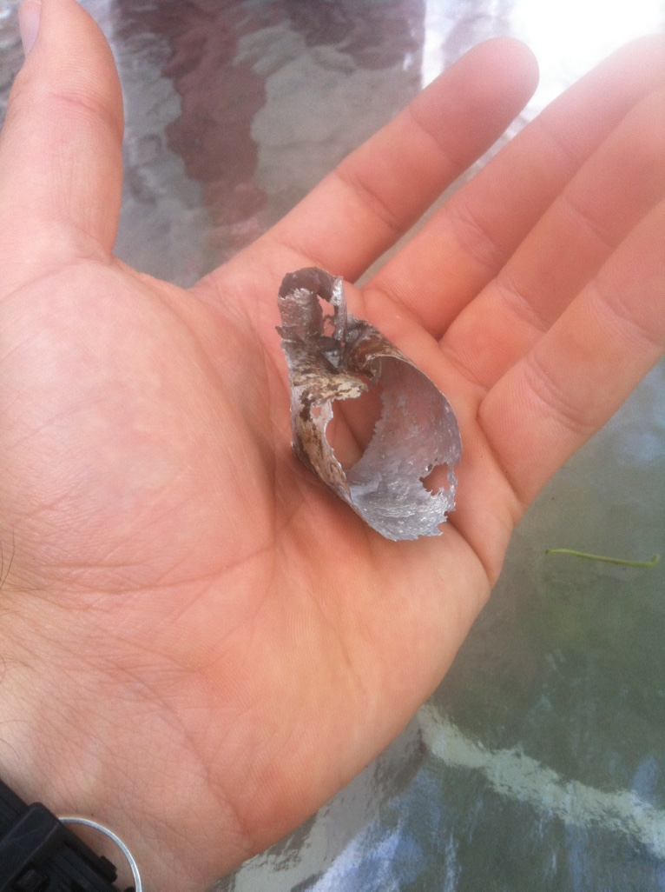

- [In short:](#org7b45eff)
    - [In long:](#org6411bac)
      - [What didn't work:](#org095112e)
      - [What did work:](#org987afee)
      - [I had apex custom coating in Monona, WI repaint my frame.](#org26b3213)

# In short:

Use a sodium hydroxide solution with proper protection and ventilation. Be patient. Use rubber stoppers to block holes in frame (bottom bracket and water bottle braze-ons.

# In long:

My seatpost had been stuck in my steel frame for years. Fortunately it was at the proper height, so it didn't bother me. When my headset broke and needed to be replaced, I figured I'd take care of the seatpost at the same time. I wasted an incredible amount of time trying to remove the seatpost and ruined my paint in the process which required a costly repowdering. This post is to share my experience so that you don't have to go through the same thing.

## What didn't work:

1.  Freezing
2.  Ammonia
3.  Pipe wrench with 5 foot bar
4.  combinations of the above
5.  Tying it between two trees and trying to pull it apart with 3 men and a 6-1 mechanical advantage system.

## What did work:

1.  Remove everything from the frame except the seatpost
2.  Use a hacksaw to remove seat and create hole to pour solution down. Leave as much of the post as possible to reduce splashing, while still creating a large hole to pour solution down. [post in frame](blog_imgs/free_seatpost/post_in_frame.jpg), [side view](blog_imgs/free_seatpost/side_post_in_frame.jpg)
3.  Stop up bottom bracket and braze-ons (any holes that will let the sodium hydroxide leak out of the seat tube) with rubber or cork stoppers. I got many of different sizes for less than a dollar at the hardware store.
4.  Place frame in well ventilated area on something to catch any spills (I used a plastic sled in my driveway). [setup](blog_imgs/free_seatpost/setup.jpg)
5.  Add sodium hydroxide salt to water (not water to salt). I did this in an old milk jug. Sodium hydroxide is sold at your local hardware store as lye or drain cleaner. Check chemical composition to verify it is NaOH. I didn't measure the concentration of the solution that I used, but you don't want it to be so concentrated that it bubbles violently out of seat tube and destroys your paint. Also, the dissolving of NaOH is exothermic and the milk jug will get quite warm, or hot if it's very concentrated.
6.  Pour solution into seat tube. The solution needs to be up to the top of the tube so that the part of the post inside the tube will dissolve, but filling it up this high risks spashes. Fill up the tube part way to make sure there isn't a ton up bubbling and splashing, then fill up to top of tube (not post). If you didn't saw off too much of the post, this length of post sticking out of tube will help give you a splash buffer. [I cut mine too short and the paint was destroyed](blog_imgs/free_seatpost/bubbling.jpg)
7.  Be patient. My seat post wall was quite thick, at least 2 mm. This will take a long time to dissolve. Wait until the solution is finished reacting with aluminum (you can hear the production of hydrogen gas), which may take a few hours. Then pour out the solution from your frame and dispose of the dark grey liquid (because I wasn't sure if the NaOH was completely used, I added vinegar in an attempt to neutralize the base).
8.  Repeat steps 5-7 until the post is completely dissolved or you can pull the post out.

## I had apex custom coating in Monona, WI repaint my frame.

They did a great job and the price was lower than everywhere else I looked, but it still wasn't cheap. Don't let the NaOH stay on your frame long!
