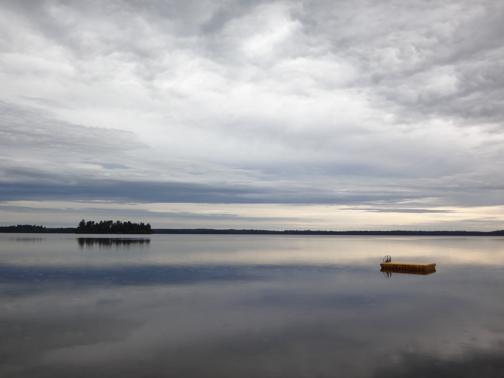
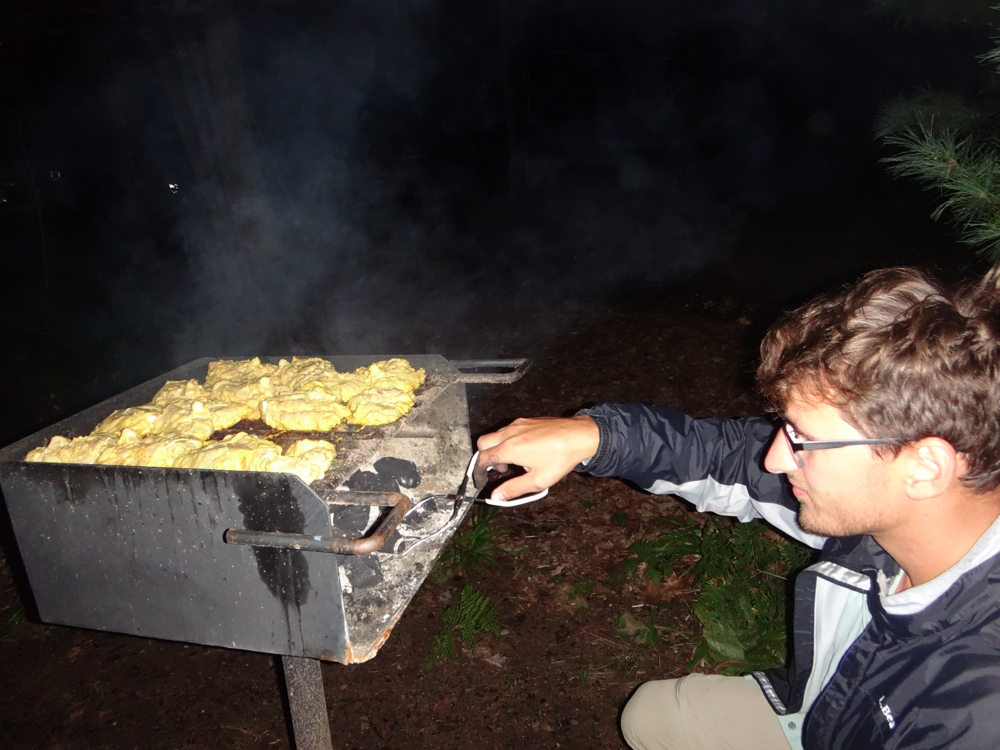
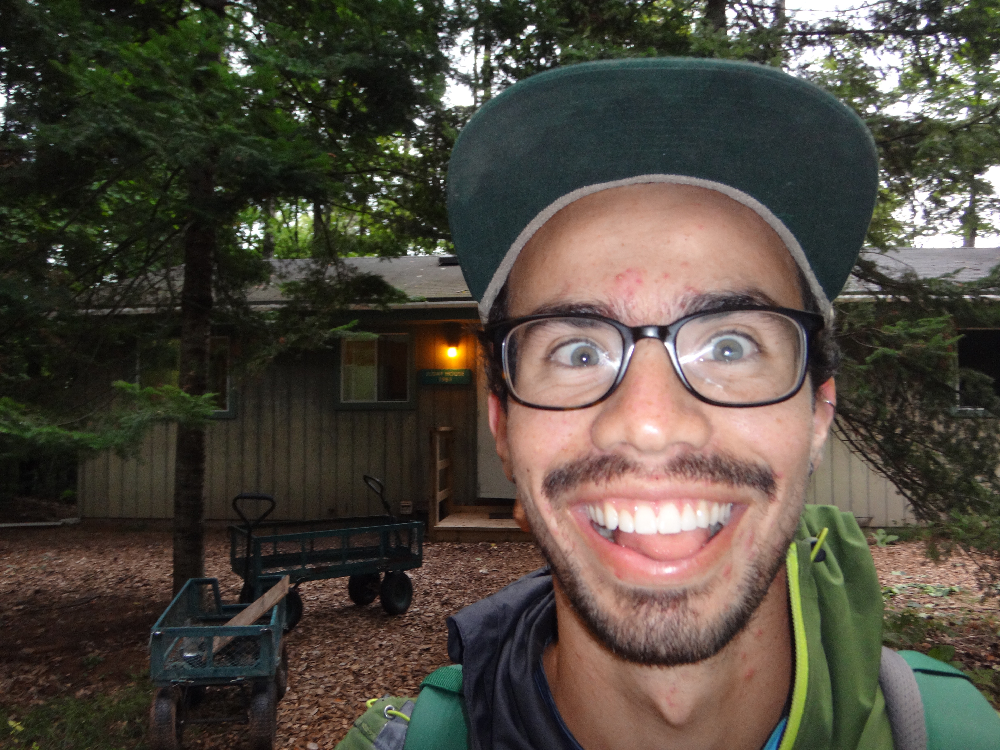

Field work provides the opportunity to be outside, help out on lab-wide projects, and to learn about new research that isn't exactly in my wheelhouse. September 8-10 I went to the north woods to help collect foliar samples as part of a NEON and Townsend lab project to ultimately predict foliar traits such as morphology, pigments, and other chemical constituents from hyperspectral imagery to create maps of these traits. This was the first year of a five year project. There's much more to the science behind the goal. But the aim of this post is not to explain all that, but rather, to share some images and the joy of being in the north woods.

")

<video width="600" align="center" controls="controls">
<source src="blog_imgs/FieldWorkUpNorth_Sep8-10/Ankur_FluxTower.mov">
</video>

Flux tower of Ankur Desai's research group, much smaller than NEON's. Maples creating lovely dappled light.
