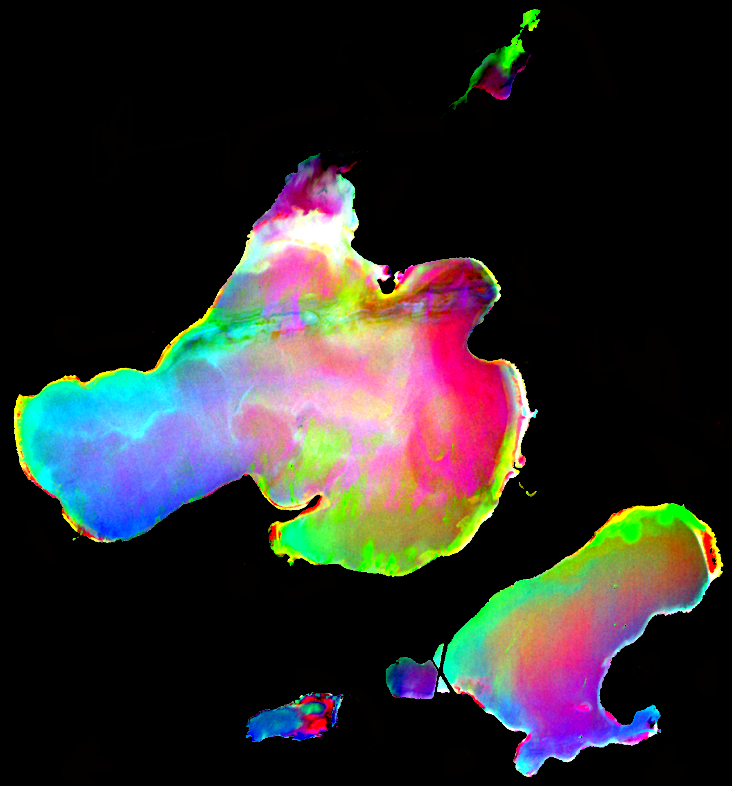

I created this image of Madison's lakes using hyperspectral imagery from NASA's [AVIRIS sensor](http://aviris.jpl.nasa.gov/) for the [Cool Science Image Contest](http://news.wisc.edu/cool-science-images-2016/). I threw it together the week before the contest and was very pleased to be selected, but I wish that it had been more related to the science that I do. It is a minimum noise fraction transformation which is a way to transform/condense the data from the ~250 bands into the 3 visible channels (rgb) for maximum information viewing. Originally I intended to create an image over land, but had great difficulty getting the mosaicing of the 3 flightlines to be seamless. You can see the band across the northern part of lake Mendota from fox bluff to warner bay that is due to image processing, not something real in the water. The image is no doubt cool, but I wish I could say more what the colors meant (If you're a limnologist and see some meaning, please let me know). I think that pink may be related to sand, and green to bright reflections on the water. There's probably some algae detection going on too. My goal for next year is to make an image that is heavier on the science and still very cool.
