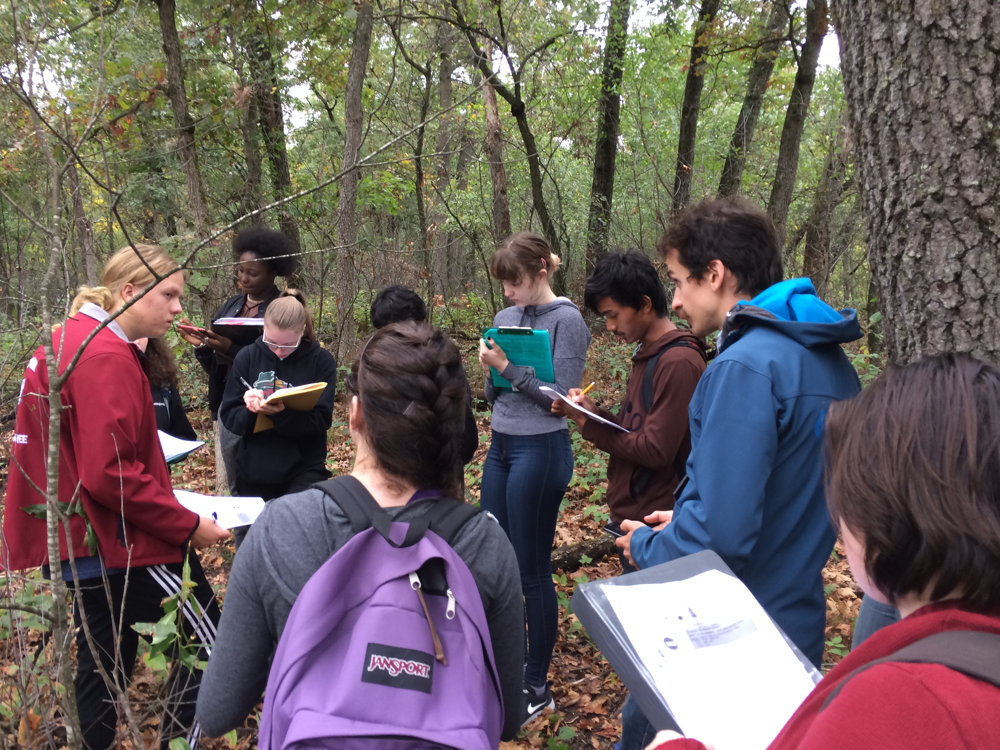

I got to help students in Madison East's AP Environmental studies on their field trip to the Madison School Forest. With 85 students and just one teacher, it was a big undertaking, but their teacher, Angie Wilcox-Hull, did an awesome job organizing.

They learned how identify common Wisconsin tree species and also did a lab on carbon in forests. Students used a clinometer and diameter at breast height tape to measure forest trees, they estimated carbon content of the trees, and they compared this to the carbon emissions caused by their transportation to and from school. As always it was great to work with high school students and there were a lot of great questions and points brought up. Here are four that were especially salient to me:

1.  Students realized that we used the equation of a cylindar to approximate the volume of a tree, but a cone is usually more appropriate.
2.  When we talked about finding the volume of wood in leaning trees, one student used his knowledge of calculus to tell me it wasn't quite so hard. See [here](https://math.stackexchange.com/a/431255/486030). I wonder if foresters use that idea for leaning trees.
3.  Carbon storage is not the same as carbon sequestration
4.  While we measured individual trees, carbon stored per area of land may be more interesting for managers.

