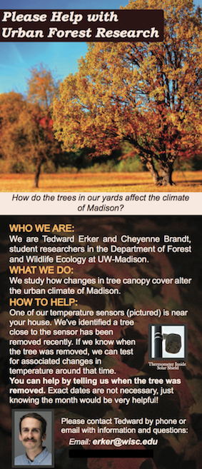
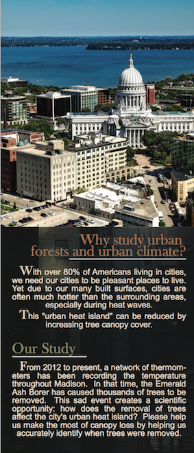

#Flyer to get citizen help with urban forest research

2017-10-18

   

This is a beautiful flyer created by Cheyenne to leave on the doors of houses who don't answer when we knock to find out when a nearby tree was removed. As of today we've had a couple responses that have given us the exact date trees were removed. Thank you Sara Sandberg and Mike Bussan!
